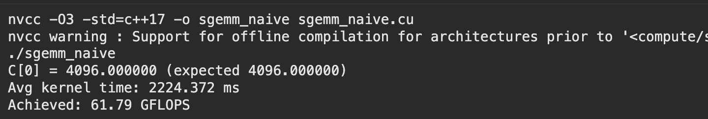

# matmul-kernel

## coalescing global memory access
## shared memory caching
## occupancy optimizations

## Kernel 1: Naive Implementation

- One thread per output element — each thread computes exactly one entry of C via a full dot product over K, using `blockIdx`/`threadIdx` to map to a unique (x, y) position in the output matrix.
- 32x32 thread blocks tiling the M x N output, with `CEIL_DIV` sizing the grid so blocks fully cover matrices whose dimensions aren't multiples of 32 (with a bounds check to handle the overhang).
- No shared memory / no data reuse. Every thread re-reads its row of A and column of B directly from global memory, K times each. Threads in the same block reading adjacent rows/columns don't share any of that traffic.
- Uncoalesced-ish access on B where consecutive threads (adjacent x) read the same column pattern of B with stride N, and A access (`A[x*K+i]`) means adjacent threads (varying in x, same y) hit far-apart rows. Access patterns aren't optimized for the GPU's memory coalescing.
- Bottleneck: memory-bound, not compute-bound and massively more global memory traffic than necessary relative to the FLOPs done, so achieved throughput is far below optimal performance.

(in progress!)
loosely following: https://siboehm.com/articles/22/CUDA-MMM

